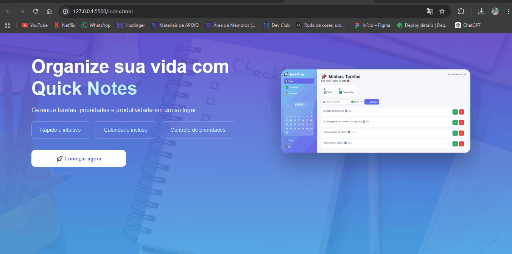

# 🚀 Quick Notes

> Aplicação web moderna para gerenciamento de tarefas com foco em produtividade, organização e experiência do usuário.

---

## 📸 Preview

---

## ✨ Sobre o projeto

O **Quick Notes** é uma aplicação web desenvolvida com o objetivo de simular um produto real de mercado, oferecendo uma experiência completa de gerenciamento de tarefas.

A aplicação permite organizar atividades do dia a dia de forma prática, com interface moderna e interações fluídas.

---

## 🧠 Funcionalidades

- ✅ CRUD completo de tarefas
- 📋 Filtros dinâmicos (todas, concluídas e pendentes)
- 🎯 Definição de prioridade (baixa, média, alta)
- 📅 Calendário interativo com indicação de tarefas
- 📊 Métricas em tempo real (total e concluídas)
- 🌙 Tema claro/escuro
- ⏰ Data e horário em tempo real
- 🔄 Drag and Drop para reordenar tarefas
- 💾 Persistência com LocalStorage
- 📱 Layout totalmente responsivo
- 📌 Sidebar fixa estilo dashboard

---

## 🛠️ Tecnologias utilizadas

- HTML5
- CSS3
- JavaScript (Vanilla JS)
- DOM Manipulation
- LocalStorage

---

## 🎯 Objetivo

Este projeto foi desenvolvido com foco em:

- Praticar manipulação de DOM
- Criar uma aplicação completa do zero
- Simular um produto real de mercado
- Melhorar habilidades em UI/UX
- Aplicar boas práticas de front-end

---

## 📂 Estrutura do projeto

📦 taskflow
┣ 📂 img
┣ 📜 index.html
┣ 📜 style.css
┣ 📜 script.js
┗ 📜 README.md

📈 Melhorias futuras

🔐 Sistema de autenticação real (Firebase/Auth)
☁️ Backend com banco de dados
📲 Transformar em PWA
🔔 Notificações
🧩 Integração com API

🤝 Contribuição

Contribuições são bem-vindas!

Sinta-se à vontade para abrir uma issue ou enviar um pull request.

⭐ Considerações finais

Este projeto representa minha evolução como desenvolvedor front-end, focando não apenas em código, mas também em experiência do usuário e construção de produtos reais.

Se você gostou do projeto, deixe uma ⭐ no repositório!

Link do projeto: https://creatingquicknotes.netlify.app/

📬 Contato
LinkedIn: https://www.linkedin.com/in/rafael-barreto-silva/  
GitHub: https://github.com/rafaelbarreto95/rafaelbarreto95
